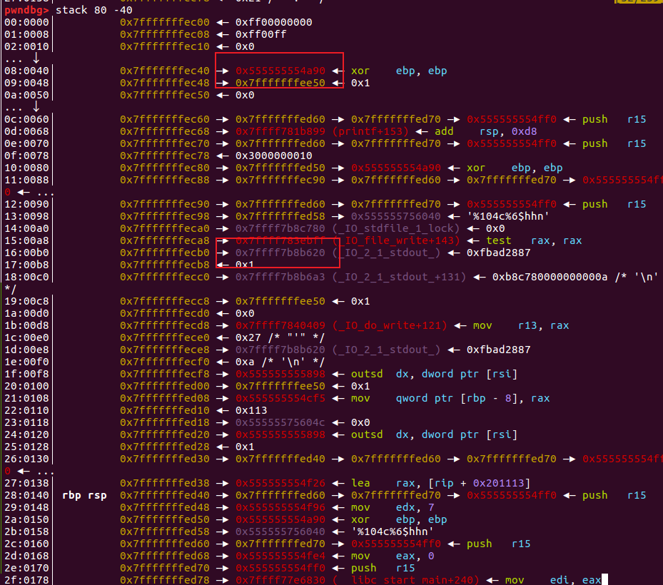

在printf处下一个断点，然后看栈情况，观察到这个时候栈的下面没有stdout结构体相关的地址,刚开始的思路是看bss上有没有stdout指针(print用到这个指针)，如果有的话把这个指针改成stderr指针就可以泄露了，但是没有。  

然后看栈的上面，可以看到有stdout相关指针，就考虑栈迁移：  

刚开始直接迁移到ec40位置，但是报错，就先修改ec40处的地址为4f8c，这里需要爆破4bit。  

迁移完了之后就是修改stdout fdno为2做泄露，然后orw链读flag。  

leave ;ret ;可以做栈迁移迁移到bss段。
